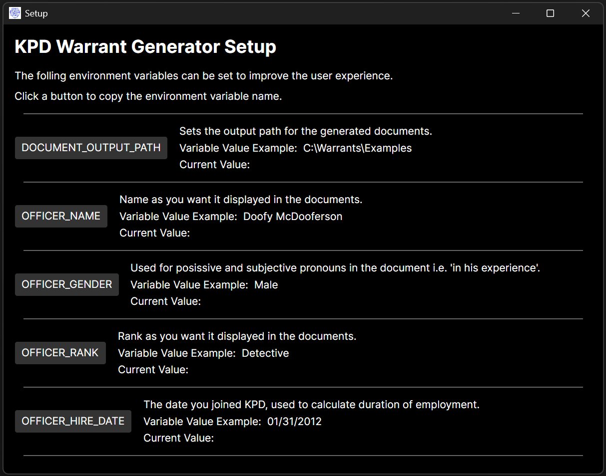
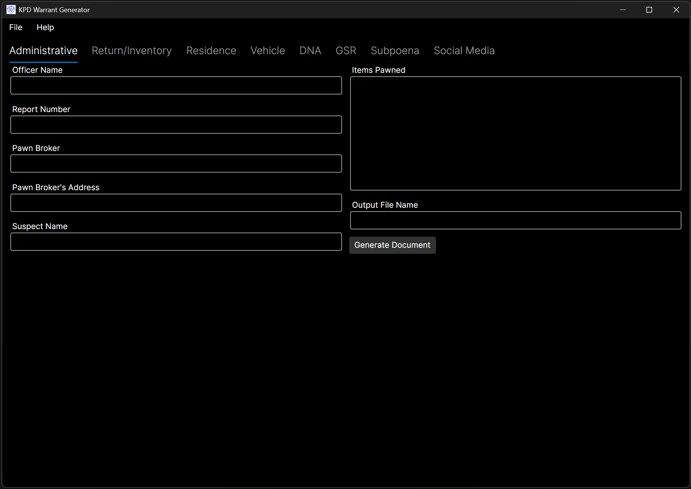
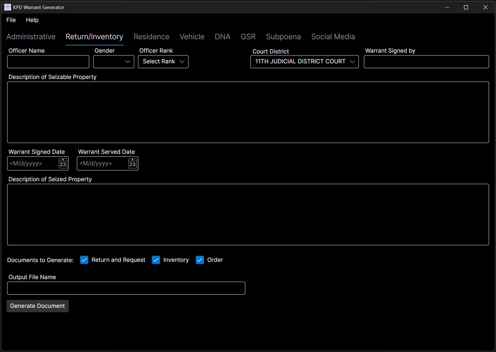
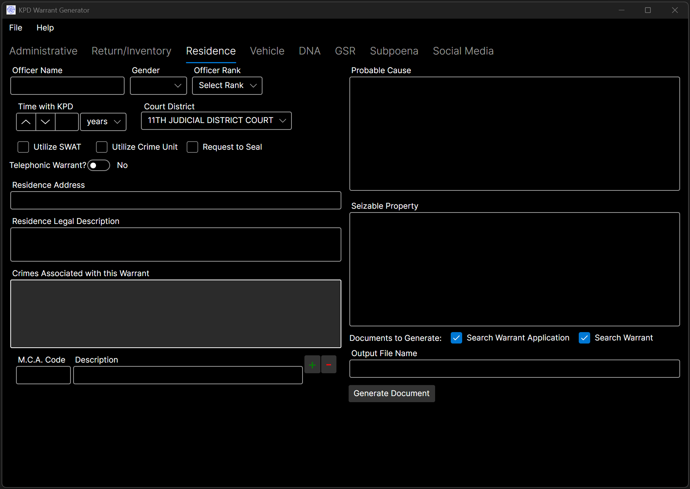
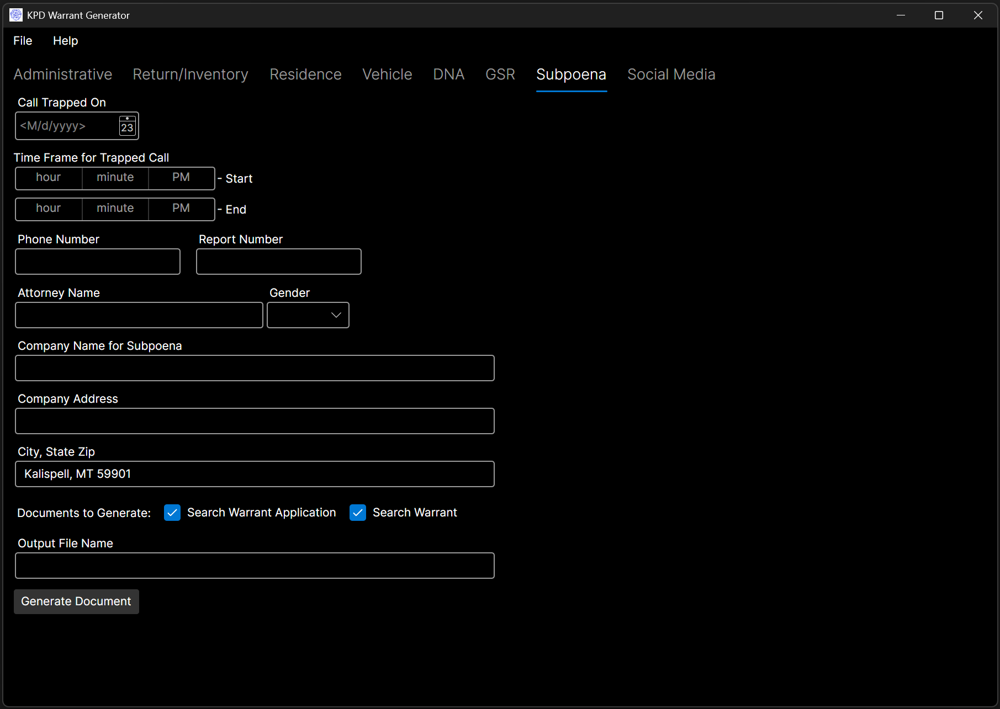
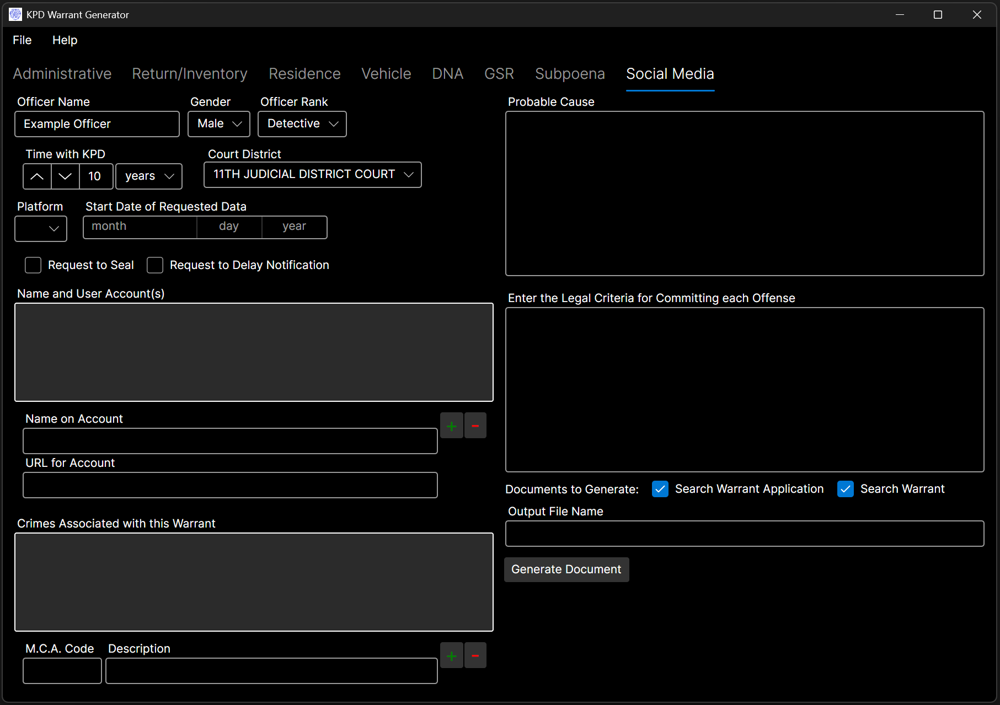

#### Please Note: This project is still a work in progress at present, but majority of the functionality is complete.

# Warrant Generator

This application was written to aid the Kalispell Police Department in generating search warrants. It allows the officer to simply enter in the pertinent information for the warrant and avoid having to type out a bunch of boilerplate, or risk incorrect data being included where content was copy/pasted from previous search warrants. The tool can produce both the warrant application, search warrant, as well as warrant return, and administrative documents for some of the most common warrants that are issued. This greatly reduces wait time for the warrant to be issued, especially in the case of a barricaded suspect.

## External Libraries

### AvaloniaUI

&nbsp;&nbsp;&nbsp;&nbsp;*Avalonia is an open source framework for building beautiful, cross-platform applications from a single .NET codebase.*

- [AvaloniaUI](https://avaloniaui.net/)

### .NET Community Toolkit

&nbsp;&nbsp;&nbsp;&nbsp;*.NET Community Toolkit is a collection of helpers and APIs that work for all .NET developers and are agnostic of any specific UI platform.*

- [Github Repository](https://github.com/CommunityToolkit/dotnet)

### Open-XML-SDK

&nbsp;&nbsp;&nbsp;&nbsp;*The Open XML SDK provides tools for working with Office Word, Excel, and PowerPoint documents.*

- [GitHub Repository](https://github.com/dotnet/Open-XML-SDK)

### Avalonia Spell Checker for TextBox

&nbsp;&nbsp;&nbsp;&nbsp;*Avalonia Spell Checker adds real-time spell-checking to Avalonia TextBox controls without replacing or changing their behavior.*

- [GitHub Repository](https://github.com/GustavoHennig/Avalonia.SpellChecker.git)

### WeCantSpell: Hunspell

&nbsp;&nbsp;&nbsp;&nbsp;*A port of Hunspell for .NET.*

- [GitHub Repository](https://github.com/aarondandy/WeCantSpell.Hunspell/)

## Usage

Select the appropriate document type, enter pertinent details into the various entry boxes of the UI, and click `Generate Document`.  There are several envoronment variables that may be set to streamline document generation.  The can be found in the `Setup` section of the `Help` menu.

## Screenshots

|||
|-|-|
|  | |
|  |  |
|  | |
|  | |

